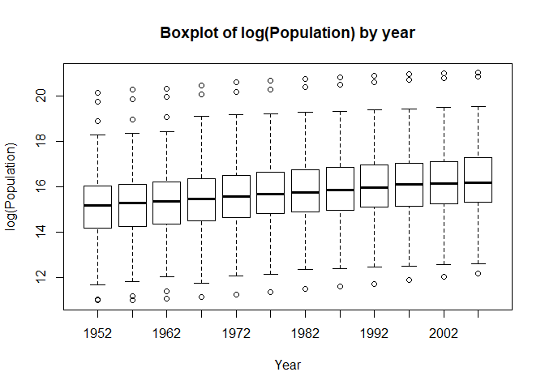
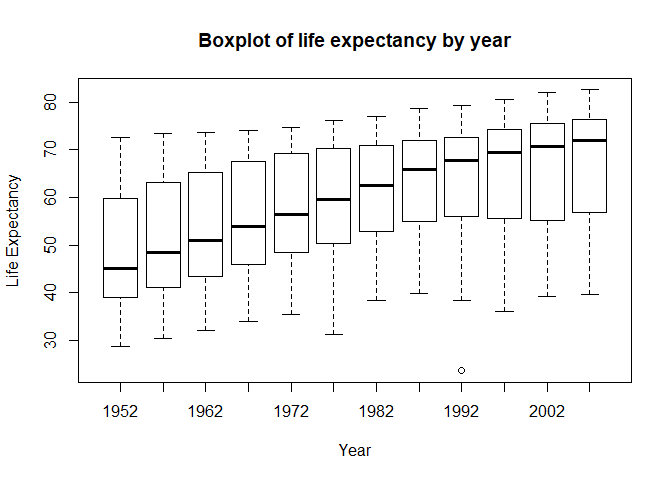
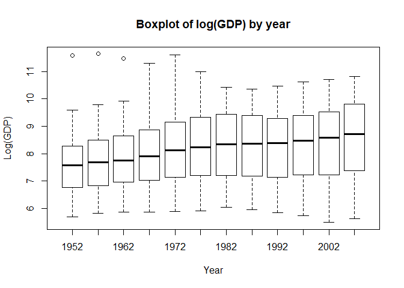

Data Analysis of the gapminder dataset
================
Vittorio Romaniello
05/09/2019

## Introduction

This file explores the gapminder dataset from the library `gapminder`.
We first load the `gapminder` package.

``` r
library(gapminder)
```

Before starting the analysis we look at the description of the dataset.

``` r
?gapminder
```

The gapminder dataset contains data on life expectancy, GDP per capita
and population by country. More information can be found at
<http://www.gapminder.org/data/>.

Now that we have a general understanding of the dataset, we can perform
some exploratory analysis.

## Analysis

The dataset contains `1704` rows and `6` columns. In line with the
description of the dataset above, we find that the columns
    are:

``` r
names(gapminder)
```

    [1] "country"   "continent" "year"      "lifeExp"   "pop"       "gdpPercap"

Given that the number of countries in the world is less that `1704`, we
have reason to believe that there might be more than one observation per
country. Let’s verify whether this is the case. The number of unique
countries in the dataset is `142`, therefore more observations for the
same country are collected over the years. Specifically in the years:

``` 
 [1] 1952 1957 1962 1967 1972 1977 1982 1987 1992 1997 2002 2007
```

### Analysis by variable

Continuing our analysis, we will focus on the variables `pop`, `lifeExp`
and `gdpPercap`, analysing each one of them separately.

#### Population

Looking at the population of the countries in the dataset, we observe
that China is the country with the largest population, followed by
India:

``` r
kable(gapminder[gapminder$pop == max(gapminder$pop),])
```

| country | continent | year | lifeExp |        pop | gdpPercap |
| :------ | :-------- | ---: | ------: | ---------: | --------: |
| China   | Asia      | 2007 |  72.961 | 1318683096 |  4959.115 |

``` r
kable(gapminder[gapminder$country != "China" & gapminder$pop == max(gapminder[gapminder$country != "China", c("pop")]),])
```

| country | continent | year | lifeExp |        pop | gdpPercap |
| :------ | :-------- | ---: | ------: | ---------: | --------: |
| India   | Asia      | 2007 |  64.698 | 1110396331 |   2452.21 |

The country with the smallest population is Sao Tome and
Principe:

``` r
kable(gapminder[gapminder$pop == min(gapminder$pop),])
```

| country               | continent | year | lifeExp |   pop | gdpPercap |
| :-------------------- | :-------- | ---: | ------: | ----: | --------: |
| Sao Tome and Principe | Africa    | 1952 |  46.471 | 60011 |  879.5836 |

The smallest population recorded is from the year 1952 while the largest
populations are from the year 2007. However, even for 2007, Sao Tome and
Principe still remains the country with the smallest
population:

``` r
kable(gapminder[gapminder$pop == min(gapminder[gapminder$year == 2007, c("pop")]),])
```

| country               | continent | year | lifeExp |    pop | gdpPercap |
| :-------------------- | :-------- | ---: | ------: | -----: | --------: |
| Sao Tome and Principe | Africa    | 2007 |  65.528 | 199579 |  1598.435 |

Overall, we observe that population has shown an increasing trend over
the years, as illustrated by the boxplot below (we have transformed the
population on a logarithmic scale in order to make the plot more
insightful).
<!-- -->

#### Life expectancy and GDP per capita

Similar analyses can be performed for the variables `lifeExp` and
`gdpPercap`. The countries with the highest and lowest life expectancy
are Japan (2007) and Rwanda (1992), respectively. In 2007, the country
with the lowest life expectancy was Swaziland.

``` r
kable(gapminder[gapminder$lifeExp == max(gapminder$lifeExp),])
```

| country | continent | year | lifeExp |       pop | gdpPercap |
| :------ | :-------- | ---: | ------: | --------: | --------: |
| Japan   | Asia      | 2007 |  82.603 | 127467972 |  31656.07 |

``` r
kable(gapminder[gapminder$lifeExp == min(gapminder$lifeExp),])
```

| country | continent | year | lifeExp |     pop | gdpPercap |
| :------ | :-------- | ---: | ------: | ------: | --------: |
| Rwanda  | Africa    | 1992 |  23.599 | 7290203 |  737.0686 |

``` r
kable(gapminder[gapminder$lifeExp == min(gapminder[gapminder$year==2007, c("lifeExp")]) ,])
```

| country   | continent | year | lifeExp |     pop | gdpPercap |
| :-------- | :-------- | ---: | ------: | ------: | --------: |
| Swaziland | Africa    | 2007 |  39.613 | 1133066 |  4513.481 |

Over the years, there was a significant change in life expectancy,
globally. The median life span increased by approximately 25 years, from
45 years in 1952 to 70 years in 2007.
<!-- -->

In terms of GDP per capita, the richest country was Kuwait (1957), with
its citizens earning as much as `113523` US$ per year. The poorest
country in the dataset was Congo (2002) with a GDP per capita of `241`
US$.

As for the previous variables, we observe that GDP per capita has
increased over the years (again we transformed the variable on a
logerithmic scale).
<!-- -->

## Conclusion

In this exercise we performed a simple data analysis of the gapminder
dataset. We observed that over the years life expectancy, GDP per capita
and population have increased. We also found that the countries with
highest/lowest GDP per capita are not also the countries with
highest/lowest life expectancy, indicating that life expectancy is
determined also by other factors than a country’s GDP.
