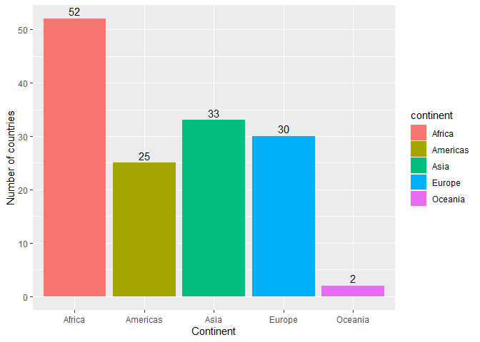
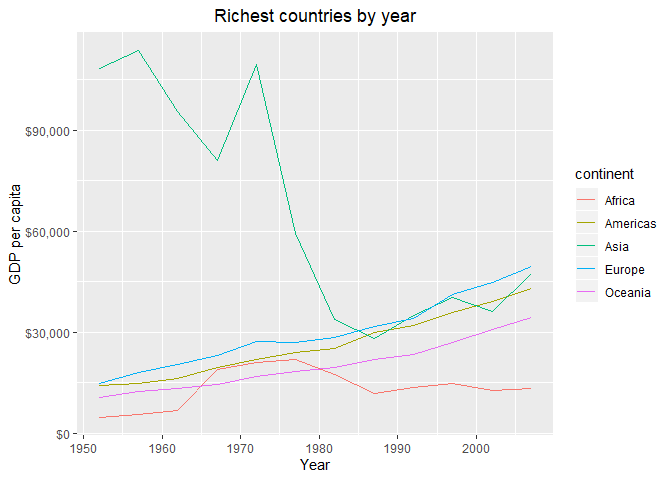
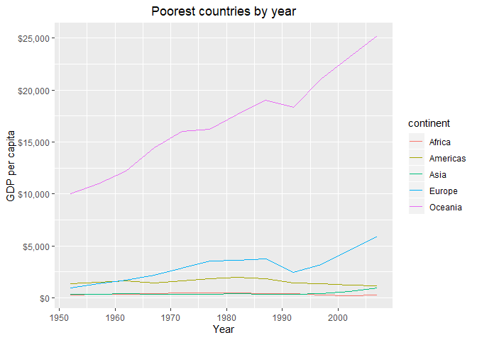
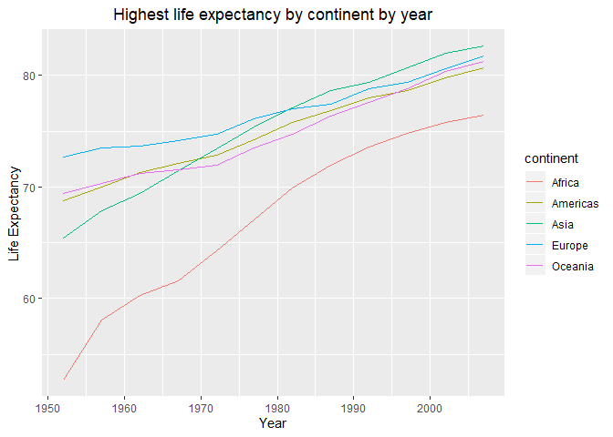

Gapminder exploration
================
Vittorio Romaniello
19/09/2019

In this document wee will answer the questions for assignment 2 for
STAT545. We will be performing an exploration of the gapminder dataset
using `dplyr` and `gpglot2`. First we load the packages needed for the
analysis

``` r
library(tidyverse)
library(gapminder)
```

# Exercise 1

As initial step of our analysis we visualize the dataset for Italy,
Spain and Canada for the 1970’s.

``` r
filtered_gapminder <- gapminder %>% 
  filter(country %in% c("Italy", "Spain", "Canada") & between(year, 1970, 1979))
```

Now we show the country and GDP per capita for each of the countries
filtered.

``` r
filtered_gapminder %>% 
  select(country, gdpPercap)
```

    ## # A tibble: 6 x 2
    ##   country gdpPercap
    ##   <fct>       <dbl>
    ## 1 Canada     18971.
    ## 2 Canada     22091.
    ## 3 Italy      12269.
    ## 4 Italy      14256.
    ## 5 Spain      10639.
    ## 6 Spain      13237.

Next we investigate which countries experienced a drop in life
expectancy over the years.

``` r
gapminder %>% 
  group_by(country) %>% 
  mutate(lifeExp_change = lifeExp - lag(lifeExp, 1, order_by = year)) %>% 
  filter(lifeExp_change < 0)
```

    ## # A tibble: 102 x 7
    ## # Groups:   country [52]
    ##    country  continent  year lifeExp     pop gdpPercap lifeExp_change
    ##    <fct>    <fct>     <int>   <dbl>   <int>     <dbl>          <dbl>
    ##  1 Albania  Europe     1992    71.6 3326498     2497.         -0.419
    ##  2 Angola   Africa     1987    39.9 7874230     2430.         -0.036
    ##  3 Benin    Africa     2002    54.4 7026113     1373.         -0.371
    ##  4 Botswana Africa     1992    62.7 1342614     7954.         -0.877
    ##  5 Botswana Africa     1997    52.6 1536536     8647.        -10.2  
    ##  6 Botswana Africa     2002    46.6 1630347    11004.         -5.92 
    ##  7 Bulgaria Europe     1977    70.8 8797022     7612.         -0.09 
    ##  8 Bulgaria Europe     1992    71.2 8658506     6303.         -0.15 
    ##  9 Bulgaria Europe     1997    70.3 8066057     5970.         -0.87 
    ## 10 Burundi  Africa     1992    44.7 5809236      632.         -3.48 
    ## # ... with 92 more rows

Between two observation periods, life expectancy has decreased in 102
cases. We also check the countries for which life expectancy decreased
between the first and last observation.

``` r
gapminder %>% 
  filter(year == min(year) | year == max(year)) %>% 
  group_by(country) %>% 
  mutate(lifeExp_change = lifeExp - lag(lifeExp, 1, order_by = year)) %>% 
  filter(lifeExp_change < 0)
```

    ## # A tibble: 2 x 7
    ## # Groups:   country [2]
    ##   country   continent  year lifeExp      pop gdpPercap lifeExp_change
    ##   <fct>     <fct>     <int>   <dbl>    <int>     <dbl>          <dbl>
    ## 1 Swaziland Africa     2007    39.6  1133066     4513.          -1.79
    ## 2 Zimbabwe  Africa     2007    43.5 12311143      470.          -4.96

Only for Swaziland and Zimbabwe life expectancy decreased between the
first and last observation period.

Next we show the maximum GDP per capita experienced by each country and
the year in which this was observed.

``` r
gapminder %>% 
  group_by(country) %>% 
  filter(gdpPercap == max(gdpPercap)) %>% 
  select(country, year, gdpPercap)
```

    ## # A tibble: 142 x 3
    ## # Groups:   country [142]
    ##    country      year gdpPercap
    ##    <fct>       <int>     <dbl>
    ##  1 Afghanistan  1982      978.
    ##  2 Albania      2007     5937.
    ##  3 Algeria      2007     6223.
    ##  4 Angola       1967     5523.
    ##  5 Argentina    2007    12779.
    ##  6 Australia    2007    34435.
    ##  7 Austria      2007    36126.
    ##  8 Bahrain      2007    29796.
    ##  9 Bangladesh   2007     1391.
    ## 10 Belgium      2007    33693.
    ## # ... with 132 more rows

In the next step we plot Canada’s life expectancy vs. the log of gdp per
capita.

``` r
gapminder %>% 
  filter(country == "Canada") %>% 
  ggplot(aes(gdpPercap, lifeExp)) + 
  geom_point() +
  scale_x_log10("GDP per capita", labels = scales::dollar_format()) + 
  labs(title="Canada's life expectancy vs. GDP per capita", y="Life Expectancy") +
  theme(plot.title = element_text(hjust = 0.5))
```

<!-- -->

There seems to be a linear relation between Canada’s life expectancy and
GDP per capita.

# Exercise 2

Next, we explore some variables in the dataset that might be of
interest. In particular, we focus on the variables GDP per capita and
continent.

## GDP per capita

First we plot the data to obtain an overall visual understanding of GDP
per capita.

``` r
gapminder %>% 
  select(gdpPercap, year) %>%
  mutate(year= factor(year)) %>% 
  ggplot(aes(year, gdpPercap)) +
  scale_y_log10("GDP per capita", labels=scales::dollar_format()) +
  geom_boxplot() + xlab("Year")
```

<!-- -->

The boxplot shows that GDP per capita has increased over the years.
However, in the years 1952-1962, there was a country with much larger
GDP per capita as compared to the others. The boxplot also shows that
the range of the variable is rather large. Folowing we show some of the
statistics of the sample grouped by year.

``` r
gapminder %>% 
  select(gdpPercap, year) %>% 
  group_by(year) %>% 
  summarise(mean_GDP = mean(gdpPercap, na.rm = TRUE),
            std_GDP = sd(gdpPercap, na.rm = TRUE),
            max_GDP = max(gdpPercap),
            min_GDP = min(gdpPercap),
            median_GDP = median(gdpPercap))
```

    ## # A tibble: 12 x 6
    ##     year mean_GDP std_GDP max_GDP min_GDP median_GDP
    ##    <int>    <dbl>   <dbl>   <dbl>   <dbl>      <dbl>
    ##  1  1952    3725.   9321. 108382.    299.      1969.
    ##  2  1957    4299.   9870. 113523.    336.      2173.
    ##  3  1962    4726.   8667.  95458.    355.      2335.
    ##  4  1967    5484.   8095.  80895.    349       2678.
    ##  5  1972    6770.  10614. 109348.    357       3339.
    ##  6  1977    7313.   8362.  59265.    371       3799.
    ##  7  1982    7519.   7734.  33693.    424       4216.
    ##  8  1987    7901.   8288.  31541.    385       4280.
    ##  9  1992    8159.   9032.  34933.    347       4386.
    ## 10  1997    9090.  10171.  41283.    312.      4782.
    ## 11  2002    9918.  11154.  44684.    241.      5320.
    ## 12  2007   11680.  12860.  49357.    278.      6124.

The table reflects the information observed in the boxplot.

# Continent

Now we move our focus to the variable continent. To indicate which
values the variable can take we provide a snapshot of the variable and
its frequency.

``` r
gapminder %>% 
  select(continent, year) %>% 
  group_by(year) %>% 
  count(continent)
```

    ## # A tibble: 60 x 3
    ## # Groups:   year [12]
    ##     year continent     n
    ##    <int> <fct>     <int>
    ##  1  1952 Africa       52
    ##  2  1952 Americas     25
    ##  3  1952 Asia         33
    ##  4  1952 Europe       30
    ##  5  1952 Oceania       2
    ##  6  1957 Africa       52
    ##  7  1957 Americas     25
    ##  8  1957 Asia         33
    ##  9  1957 Europe       30
    ## 10  1957 Oceania       2
    ## # ... with 50 more rows

We see that the counts are the same for each year. Indicating that the
countries included in the dataset do not change across years, with a
total of 142 countries. To have a clearer view of which continent is
most represented, we provide a barplot.

``` r
gapminder %>% 
  select(continent, year) %>% 
  mutate(year = factor(year)) %>% 
  group_by(year) %>% 
  count(continent, name="count_continent") %>% 
  ggplot(aes(year, count_continent)) + geom_bar(aes(fill=continent), stat="identity") +
  labs(x="Year", y="Continent frequency")
```

<!-- -->

This plot confirms the results from the table that Africa is the
continent with the largest number of countries while Oceania only has 2
countries.

# Exercise 3

To further explore the data, we compare for each continent the richest
and poorest country, as well as the countries with the highest/lowest
life expectancy.

``` r
gapminder %>% 
  group_by(continent, year) %>% 
  filter(gdpPercap == max(gdpPercap)) %>% 
  select(country, continent, year, gdpPercap) %>% 
  ggplot(aes(year, gdpPercap, color=continent)) +
  geom_point() +
  xlab("Year") + 
  scale_y_continuous(labels=scales::dollar_format()) + 
  labs(title="Richest countries by year", y="GDP per capita") +
  theme(plot.title = element_text(hjust = 0.5))
```

<!-- -->

We see that the Asia has had the richest country in the world until the
1980’s where European countries have been the richest. Africa has
generally been the poorest continent. We can also notice that the
difference in GDP per capita among the richest countries of each
continent has shrunk over the years with the exception of Africa.

``` r
gapminder %>% 
  group_by(continent, year) %>% 
  filter(gdpPercap == min(gdpPercap)) %>% 
  select(country, continent, year, gdpPercap) %>% 
  ggplot(aes(year, gdpPercap, color=continent)) +
  geom_point() +
  xlab("Year") + 
  scale_y_continuous(labels=scales::dollar_format()) + 
  labs(title="Poorest countries by year", y="GDP per capita") +
  theme(plot.title = element_text(hjust = 0.5))
```

<!-- -->

Plotting the poorest countries we see that while for all continents the
poorest countries did not improve their GDP per capita over the years,
in Oceania this was not the case.

Lastly, we show the same plots for life expectancy.

``` r
gapminder %>% 
  group_by(continent, year) %>% 
  filter(lifeExp == max(lifeExp)) %>% 
  select(country, continent, year, lifeExp) %>% 
  ggplot(aes(year, lifeExp, color=continent)) +
  geom_point() +
  xlab("Year") + 
  labs(title="Highest life expectancy by continent by year", y="Life Expectancy") +
  theme(plot.title = element_text(hjust = 0.5))
```

<!-- -->

``` r
gapminder %>% 
  group_by(continent, year) %>% 
  filter(lifeExp == min(lifeExp)) %>% 
  select(country, continent, year, lifeExp) %>% 
  ggplot(aes(year, lifeExp, color=continent)) +
  geom_point() +
  xlab("Year") + 
  labs(title="Lowest life expectancy by continent by year", y="Life Expectancy") +
  theme(plot.title = element_text(hjust = 0.5))
```

<!-- -->

The two plots show that in the countries with highest life expectancy,
life expectancy has increased dramatically over the years, especially
for African countries. An increase in life expectancy has also been
noticed for the countries that had the lowest life expectancy.
Indicating that overall life expectancy has increased, as shown in the
boxplots for assignment 1. A special case in this plot is for african
countries where, in the 1990’s thre was a sharp decline in life
expectancy, probably due to civil wars.

# Extra exercise

``` r
filter(gapminder, country == c("Rwanda", "Afghanistan"))
```

    ## # A tibble: 12 x 6
    ##    country     continent  year lifeExp      pop gdpPercap
    ##    <fct>       <fct>     <int>   <dbl>    <int>     <dbl>
    ##  1 Afghanistan Asia       1957    30.3  9240934      821.
    ##  2 Afghanistan Asia       1967    34.0 11537966      836.
    ##  3 Afghanistan Asia       1977    38.4 14880372      786.
    ##  4 Afghanistan Asia       1987    40.8 13867957      852.
    ##  5 Afghanistan Asia       1997    41.8 22227415      635.
    ##  6 Afghanistan Asia       2007    43.8 31889923      975.
    ##  7 Rwanda      Africa     1952    40    2534927      493.
    ##  8 Rwanda      Africa     1962    43    3051242      597.
    ##  9 Rwanda      Africa     1972    44.6  3992121      591.
    ## 10 Rwanda      Africa     1982    46.2  5507565      882.
    ## 11 Rwanda      Africa     1992    23.6  7290203      737.
    ## 12 Rwanda      Africa     2002    43.4  7852401      786.

When running this command we do not obtain all observations we expected,
it seems like even years get assigned to Rwanda while odd years to
Afghanistan. To perform the query properly, we can modify the statement
in this way

``` r
filter(gapminder, country %in% c("Rwanda", "Afghanistan"))
```

    ## # A tibble: 24 x 6
    ##    country     continent  year lifeExp      pop gdpPercap
    ##    <fct>       <fct>     <int>   <dbl>    <int>     <dbl>
    ##  1 Afghanistan Asia       1952    28.8  8425333      779.
    ##  2 Afghanistan Asia       1957    30.3  9240934      821.
    ##  3 Afghanistan Asia       1962    32.0 10267083      853.
    ##  4 Afghanistan Asia       1967    34.0 11537966      836.
    ##  5 Afghanistan Asia       1972    36.1 13079460      740.
    ##  6 Afghanistan Asia       1977    38.4 14880372      786.
    ##  7 Afghanistan Asia       1982    39.9 12881816      978.
    ##  8 Afghanistan Asia       1987    40.8 13867957      852.
    ##  9 Afghanistan Asia       1992    41.7 16317921      649.
    ## 10 Afghanistan Asia       1997    41.8 22227415      635.
    ## # ... with 14 more rows

or by writing a bit
more

``` r
DT::datatable(filter(gapminder, country == "Rwanda" | country =="Afghanistan"))
```

<!-- -->
