This assignment is a continuation of assignments 1 and 2 and provides a more in-depth exploration of the gapminder dataset. In particular, we use `dlypr` and `ggplo2` to analyse and visualise important aspects of the dataset. As usual, we first load the libraries that we will use throughout the assignment.


```r
library(tidyverse)
library(gapminder)
library(knitr)
```

Now that we have access to the dataset we can start the analysis.

### Task 2
We start by inspecting GDP per capita by continent. We focus on finding the maximum and minimum GDP per capita by continent.


```r
gdp_by_continent = gapminder %>% 
  group_by(continent) %>% 
  arrange(desc(gdpPercap)) %>% 
  filter(row_number() %in% c(1, n())) %>% 
  select(continent, year, country, gdpPercap) %>% 
  arrange(continent, gdpPercap)
gdp_by_continent %>% 
  DT::datatable()
```

<!--html_preserve--><div id="htmlwidget-0719864ec42b742f3a9c" style="width:100%;height:auto;" class="datatables html-widget"></div>
<script type="application/json" data-for="htmlwidget-0719864ec42b742f3a9c">{"x":{"filter":"none","data":[["1","2","3","4","5","6","7","8","9","10"],["Africa","Africa","Americas","Americas","Asia","Asia","Europe","Europe","Oceania","Oceania"],[2002,1977,2007,2007,1952,1957,1952,2007,1952,2007],["Congo, Dem. Rep.","Libya","Haiti","United States","Myanmar","Kuwait","Bosnia and Herzegovina","Norway","Australia","Australia"],[241.1658765,21951.21176,1201.637154,42951.65309,331,113523.1329,973.5331948,49357.19017,10039.59564,34435.36744]],"container":"<table class=\"display\">\n  <thead>\n    <tr>\n      <th> <\/th>\n      <th>continent<\/th>\n      <th>year<\/th>\n      <th>country<\/th>\n      <th>gdpPercap<\/th>\n    <\/tr>\n  <\/thead>\n<\/table>","options":{"columnDefs":[{"className":"dt-right","targets":[2,4]},{"orderable":false,"targets":0}],"order":[],"autoWidth":false,"orderClasses":false}},"evals":[],"jsHooks":[]}</script><!--/html_preserve-->

We observe that in every continent, except from Oceania, the difference between maximum and minimum GDP per capita registered is rather large. The barplot below visualises such intuition.


```r
gdp_by_continent %>% 
  group_by(continent) %>% 
  mutate(label_colour = ifelse(gdpPercap == max(gdpPercap), 1, 2)) %>% 
ggplot(aes(x=continent, y=gdpPercap, fill=factor(label_colour))) +
  geom_bar(stat = "identity", position = "dodge") +
  scale_fill_discrete(name="", breaks=c(1,2), labels=c("Maximum", "Minimum"), guide=guide_legend())  +
  scale_y_log10(labels=scales::dollar_format()) + 
  xlab("Continent") + ylab("GDP per capita")
```

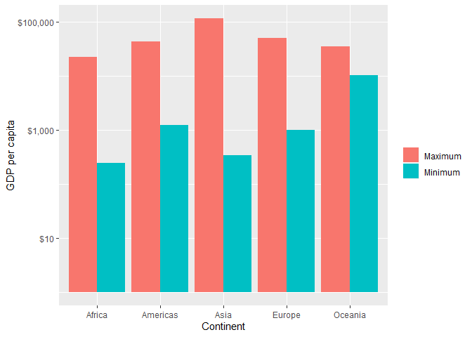<!-- -->

The barplot shows the maximum and minimum GDP per capita per each continent on a log scale. The log scale allows to observe the difference in GDP per capita better by reducing the size of the bars of the highest GDP per capita and increasing that of the lowesst. The labels on the y-axis maintain, however, the dollar scale so that we can still observe the large difference. For instance, in Asia, the maximum GDP per capita is of `100,000$` while the lowest is of less than `1,000$`. The code to produce this plot was adjusted from [Stack Overflow](
 https://stackoverflow.com/questions/22305023/how-to-get-a-barplot-with-several-variables-side-by-side-grouped-by-a-factor).
 
 In addition to this global analysis, we can analyse the maximum and minimum GDP per capita by year for each continent.
 

```r
gdp_continent_year = gapminder %>% 
  group_by(continent, year) %>% 
  arrange(desc(gdpPercap)) %>% 
  filter(row_number() %in% c(1, n())) %>% 
  mutate(label_colour = ifelse(gdpPercap == max(gdpPercap), 1, 2)) %>% 
  select(continent, year, country, gdpPercap, label_colour) %>% 
  arrange(continent, year, gdpPercap)

gdp_continent_year %>% 
  filter(continent == "Asia") %>%
  ggplot(aes(x=year, y=gdpPercap, fill=factor(label_colour))) +
  geom_bar(stat = "identity", position = "dodge") +
  scale_fill_discrete(name="", breaks=c(1,2), labels=c("Maximum", "Minimum"), guide=guide_legend())  +
  scale_y_continuous(labels=scales::dollar_format()) +
  xlab("Year") + ylab("GDP per capita") + labs(title = "Asia") + theme(plot.title = element_text(hjust = 0.5))
```

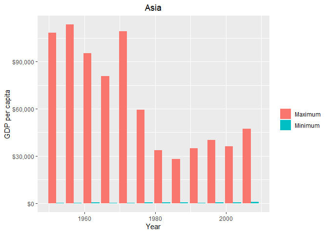<!-- -->
 

```r
gdp_continent_year %>% 
  filter(continent == "Americas") %>%
  ggplot(aes(x=year, y=gdpPercap, fill=factor(label_colour))) +
  geom_bar(stat = "identity", position = "dodge") +
  scale_fill_discrete(name="", breaks=c(1,2), labels=c("Maximum", "Minimum"), guide=guide_legend())  +
  scale_y_continuous(labels=scales::dollar_format()) +
  xlab("Year") + ylab("GDP per capita") + labs(title = "Americas") + theme(plot.title = element_text(hjust = 0.5))
```

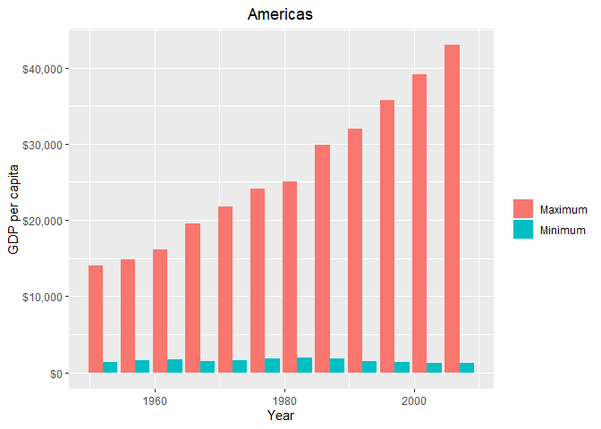<!-- -->


```r
gdp_continent_year %>% 
  filter(continent == "Europe") %>%
  ggplot(aes(x=year, y=gdpPercap, fill=factor(label_colour))) +
  geom_bar(stat = "identity", position = "dodge") +
  scale_fill_discrete(name="", breaks=c(1,2), labels=c("Maximum", "Minimum"), guide=guide_legend())  +
  scale_y_continuous(labels=scales::dollar_format()) +
  xlab("Year") + ylab("GDP per capita") + labs(title = "Europe") + theme(plot.title = element_text(hjust = 0.5))
```

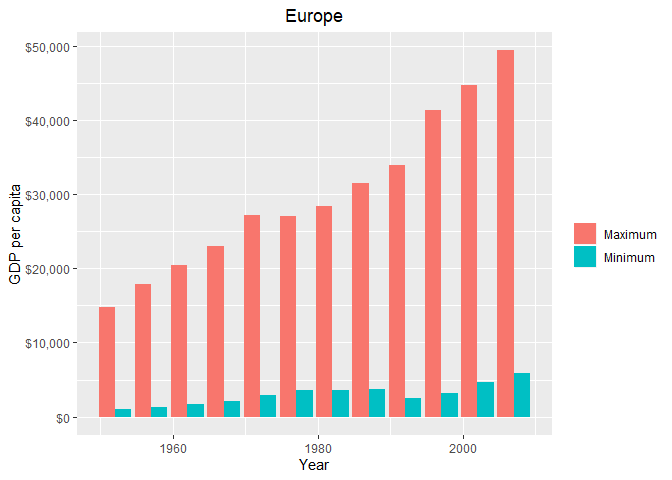<!-- -->


```r
gdp_continent_year %>% 
  filter(continent == "Oceania") %>%
  ggplot(aes(x=year, y=gdpPercap, fill=factor(label_colour))) +
  geom_bar(stat = "identity", position = "dodge") +
  scale_fill_discrete(name="", breaks=c(1,2), labels=c("Maximum", "Minimum"), guide=guide_legend())  +
  scale_y_continuous(labels=scales::dollar_format()) +
  xlab("Year") + ylab("GDP per capita") + labs(title = "Oceania") + theme(plot.title = element_text(hjust = 0.5))
```

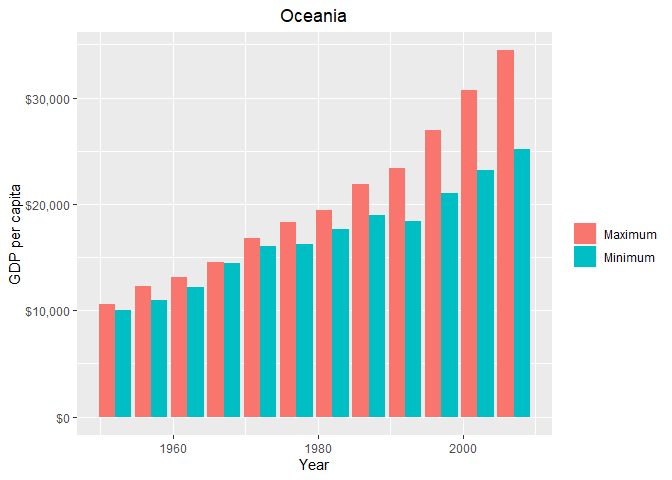<!-- -->


```r
gdp_continent_year %>% 
  filter(continent == "Africa") %>%
  ggplot(aes(x=year, y=gdpPercap, fill=factor(label_colour))) +
  geom_bar(stat = "identity", position = "dodge") +
  scale_fill_discrete(name="", breaks=c(1,2), labels=c("Maximum", "Minimum"), guide=guide_legend())  +
  scale_y_continuous(labels=scales::dollar_format()) +
  xlab("Year") + ylab("GDP per capita") + labs(title = "Africa") + theme(plot.title = element_text(hjust = 0.5))
```

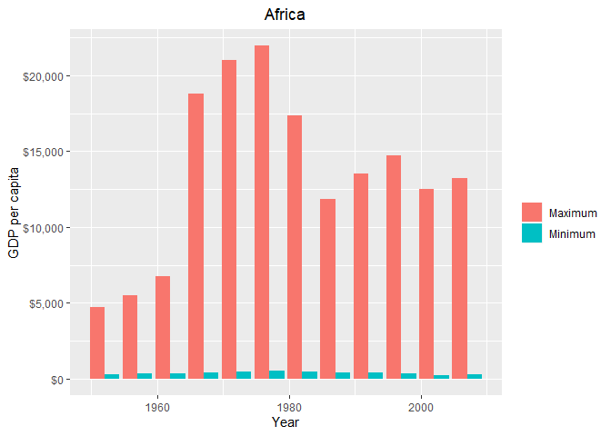<!-- -->

From the plots above, we can deduce similar observations as for the plot that did not consider the year. Apart from Oceania, there is a difference between maximum and minimum GDP per capita in all other continents throughout the years. While in Europe, Oceania and the Americas the maximum GDP per capita has increased steadily over the years, for Asia and Africa there have been fluctuations in the maximum GDP. Note, in the plots above we did not scale the variables using the log transformation because this made the difference and corresponding increase/decrease in GDP more visible.

### Task 3
Continuing our analysis of GDP per capita, we now look at the spread of GDP per capita within continents. The analysis in Task 2 suggests that the spread within continents will be large. However, we conduct an analysis to quantify such claim. Similarly to above, we first look at continents aggregated and later on analyse each continent by year.


```r
gapminder %>% 
  group_by(continent) %>% 
  summarise(median=median(gdpPercap), mean=mean(gdpPercap), sd = sd(gdpPercap),  IQR = IQR(gdpPercap),
            max=max(gdpPercap), min=min(gdpPercap), spread_max_min = max- min) %>% 
  DT::datatable()
```

<!--html_preserve--><div id="htmlwidget-bba9feca029b470a2de9" style="width:100%;height:auto;" class="datatables html-widget"></div>
<script type="application/json" data-for="htmlwidget-bba9feca029b470a2de9">{"x":{"filter":"none","data":[["1","2","3","4","5"],["Africa","Americas","Asia","Europe","Oceania"],[1192.138217,5465.509853,2646.786844,12081.749115,17983.303955],[2193.75457828574,7136.11035559,7902.15042805404,14469.4755333022,18621.6092233333],[2827.92986262485,6396.76411174972,14045.3731116838,9355.21349837552,6358.98332068975],[1616.170412225,4402.4313435,7492.2624315,13248.301126,8072.2584125],[21951.21176,42951.65309,113523.1329,49357.19017,34435.36744],[241.1658765,1201.637154,331,973.5331948,10039.59564],[21710.0458835,41750.015936,113192.1329,48383.6569752,24395.7718]],"container":"<table class=\"display\">\n  <thead>\n    <tr>\n      <th> <\/th>\n      <th>continent<\/th>\n      <th>median<\/th>\n      <th>mean<\/th>\n      <th>sd<\/th>\n      <th>IQR<\/th>\n      <th>max<\/th>\n      <th>min<\/th>\n      <th>spread_max_min<\/th>\n    <\/tr>\n  <\/thead>\n<\/table>","options":{"columnDefs":[{"className":"dt-right","targets":[2,3,4,5,6,7,8]},{"orderable":false,"targets":0}],"order":[],"autoWidth":false,"orderClasses":false}},"evals":[],"jsHooks":[]}</script><!--/html_preserve-->

The table reports some summary statistics that can help understand the spread in GDP per capita within continents. The spread between maximum and minimum GDP is considerably higher for Asia, for which GDP per capita also has the highest variance. The data in the table above is not easy to read. To better understand these results we use a boxplot


```r
gapminder %>% 
  ggplot(aes(x=continent, y=gdpPercap)) +
  geom_boxplot() + 
  scale_y_log10(labels=scales::dollar_format()) + 
  xlab("Continent") + ylab("GDP per capita")
```

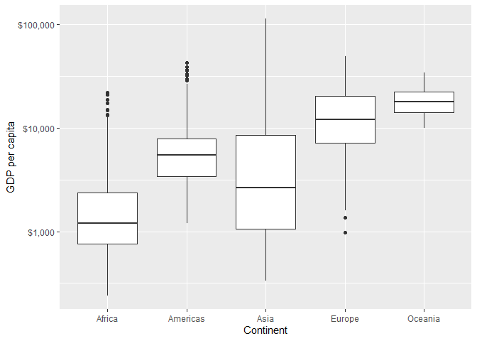<!-- -->

The boxplot allows to visualise the spread in GDP per capita in a way that is easier to read. Similarly to Task 2, he boxplot above scales GDP per capita using the log transformation to allow for a better readability of the plot. From the boxplot we can see that in Oceania the GDP spread is smaller than for other continents. Asia is the continent with the largest spread in GDP, followed by Africa, where the median GDP is low, around `1,000$` but some observations are outliers with more than `10,000$`. Americas have overall a lower median GDP per capita than  Europe.

Now we perform the same analysis by year for each continent.


```r
gapminder %>%
  filter(continent == "Oceania") %>% 
  ggplot(aes(x=year, y=gdpPercap, group=year)) +
  geom_boxplot() + 
  scale_y_log10(labels=scales::dollar_format()) + 
  xlab("Year") + ylab("GDP per capita") + labs(title = "Oceania") + theme(plot.title = element_text(hjust = 0.5))
```

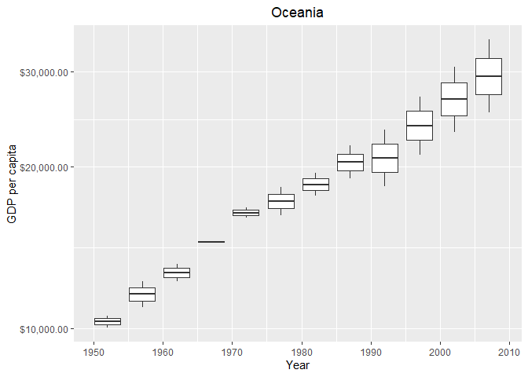<!-- -->


```r
gapminder %>%
  filter(continent == "Asia") %>% 
  ggplot(aes(x=year, y=gdpPercap, group=year)) +
  geom_boxplot() + 
  scale_y_log10(labels=scales::dollar_format()) + 
  xlab("Year") + ylab("GDP per capita") + labs(title = "Asia") + theme(plot.title = element_text(hjust = 0.5))
```

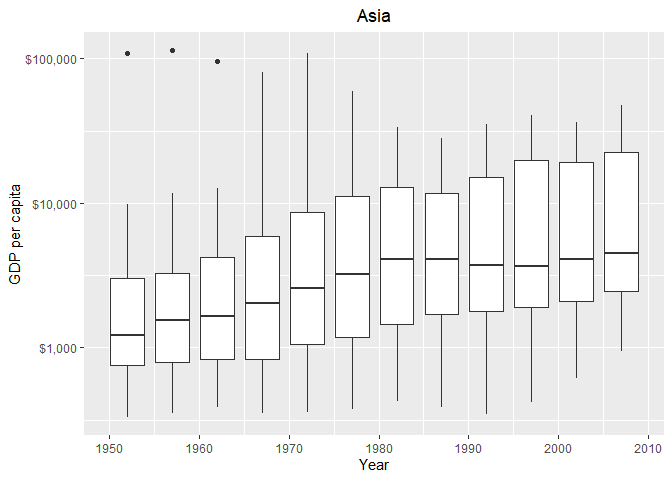<!-- -->


```r
gapminder %>%
  filter(continent == "Africa") %>% 
  ggplot(aes(x=year, y=gdpPercap, group=year)) +
  geom_boxplot() + 
  scale_y_log10(labels=scales::dollar_format()) + 
  xlab("Year") + ylab("GDP per capita") + labs(title = "Africa") + theme(plot.title = element_text(hjust = 0.5))
```

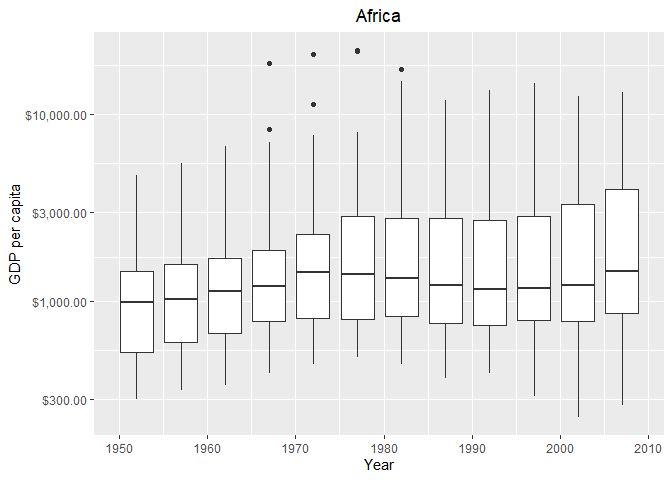<!-- -->


```r
gapminder %>%
  filter(continent == "Americas") %>% 
  ggplot(aes(x=year, y=gdpPercap, group=year)) +
  geom_boxplot() + 
  scale_y_log10(labels=scales::dollar_format()) + 
  xlab("Year") + ylab("GDP per capita") + labs(title = "Americas") + theme(plot.title = element_text(hjust = 0.5))
```

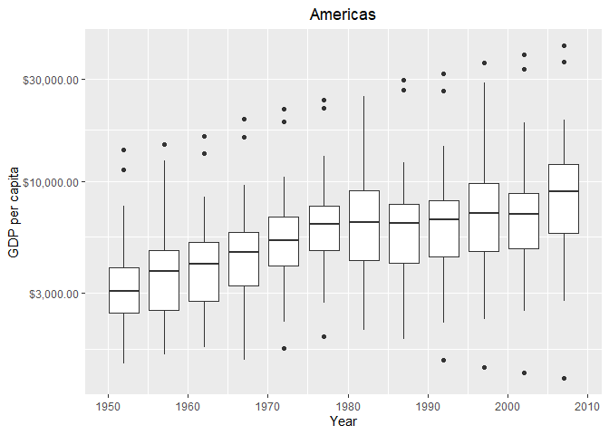<!-- -->


```r
gapminder %>%
  filter(continent == "Europe") %>% 
  ggplot(aes(x=year, y=gdpPercap, group=year)) +
  geom_boxplot() + 
  scale_y_log10(labels=scales::dollar_format()) + 
  xlab("Year") + ylab("GDP per capita") + labs(title = "Europe") + theme(plot.title = element_text(hjust = 0.5))
```

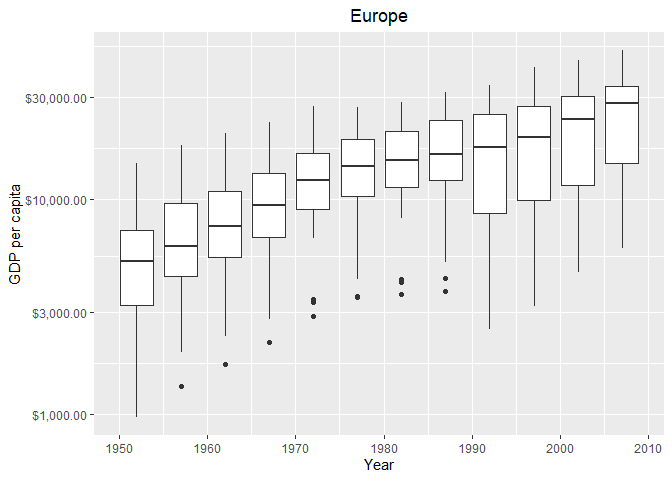<!-- -->

Overall we observe that in all continents apart from Africa, the median GDP per capita has increased over the years. Furthermore, there seems to be an increase in the spread of GDP per capita for the years after the 1990's with respect to the previous years in most continents.

### Task 4
Having thoroughly analysed the gapminder dataset for what concerns GDP per capita, we now move to the analysis of life expectancy. Firstly, we check whether the mean life expectancy over the years changes when we account for population.


```r
life_exp_mean = gapminder %>% 
  group_by(year) %>% 
  summarise(mean = mean(lifeExp), mean_weighted = weighted.mean(x = lifeExp, w = pop)) %>% 
  mutate(diff_means = mean_weighted - mean) %>% 
  arrange(year)

life_exp_mean %>% 
  DT::datatable()
```

<!--html_preserve--><div id="htmlwidget-1e99070dd9ef4d7cc6bb" style="width:100%;height:auto;" class="datatables html-widget"></div>
<script type="application/json" data-for="htmlwidget-1e99070dd9ef4d7cc6bb">{"x":{"filter":"none","data":[["1","2","3","4","5","6","7","8","9","10","11","12"],[1952,1957,1962,1967,1972,1977,1982,1987,1992,1997,2002,2007],[49.0576197183099,51.5074011267606,53.6092490140845,55.6782895774648,57.6473864788732,59.5701574647887,61.5331971830986,63.2126126760563,64.160338028169,65.014676056338,65.6949225352113,67.0074225352113],[48.9442367328978,52.1218850827385,52.3243820828789,56.9843067912689,59.5147829246504,61.2372559476396,62.8817553917975,64.4163500580769,65.6458996955676,66.8493429481753,67.8390413897749,68.9190925190404],[-0.113382985412059,0.614483955977889,-1.28486693120557,1.30601721380408,1.86739644577718,1.66709848285091,1.34855820869895,1.20373738202061,1.48556166739856,1.83466689183726,2.14411885456367,1.91166998382916]],"container":"<table class=\"display\">\n  <thead>\n    <tr>\n      <th> <\/th>\n      <th>year<\/th>\n      <th>mean<\/th>\n      <th>mean_weighted<\/th>\n      <th>diff_means<\/th>\n    <\/tr>\n  <\/thead>\n<\/table>","options":{"columnDefs":[{"className":"dt-right","targets":[1,2,3,4]},{"orderable":false,"targets":0}],"order":[],"autoWidth":false,"orderClasses":false}},"evals":[],"jsHooks":[]}</script><!--/html_preserve-->

The column `diff_mean` shows the difference in mean life expectancy between the weighted and non-weighted version of the mean. What we can observe is that while for the 1950's and 1960's there is not a marked difference between the two measures, for the years after the 1960's this difference increases. The largest difference between the two measures is around 2 years, this is likely due to the fact that countries where population rose are also countries with higher life expectancy hence, they are weighted more in the mean computation.

To visualise the result we use bar plots, similarly to Task 2, as well as a line plot.


```r
life_exp_mean %>% 
  pivot_longer(c(mean, mean_weighted))  %>% 
  ggplot(aes(x=year, y=value, fill=name)) +
  geom_bar(stat="identity", position="dodge") +
  scale_fill_discrete(name="Means", breaks = c("mean","mean_weighted"), labels=c("Simple", "Weighted"), guide=guide_legend())+
  xlab("Year") + ylab("Mean Life Expectancy")
```

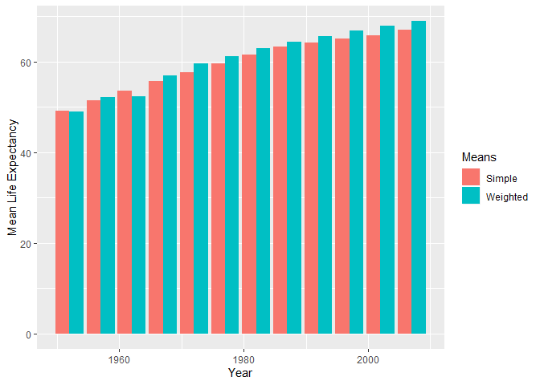<!-- -->

The barplot shows our claim at a glance. 


```r
life_exp_mean %>% 
  ggplot(aes(x=year, y=diff_means)) +
  geom_line() +
  xlab("Year") + ylab("Delta life expectancy") + labs(title="Difference betweeen weighted and simple mean") +
  theme(plot.title = element_text(hjust = 0.5))
```

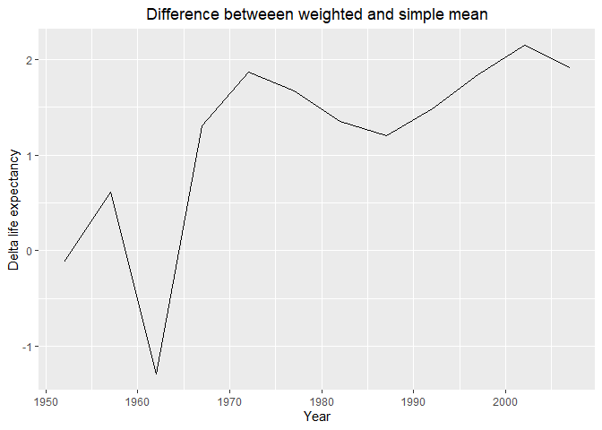<!-- -->


The line plot shows that the mean life expectancy computed using the weighted average is higher than the simple mean in all years apart from one point in the 1960's. Despite the results above, it is still arguable whether using the weighted mean is better than the simple mean. I believe this decision depends on the purpose of our analysis and needs more consieration than just a value comparison.

### Task 5
We continue our analysis by looking at how life expectancy changes over time in different continents. The data that we will use for the visualisation is given by the following query


```r
change_life_exp = gapminder %>% 
  group_by(continent, year) %>% 
  summarise(mean_life_exp = weighted.mean(lifeExp, pop))
change_life_exp %>% 
  DT::datatable()
```

<!--html_preserve--><div id="htmlwidget-76adf38e054939529d01" style="width:100%;height:auto;" class="datatables html-widget"></div>
<script type="application/json" data-for="htmlwidget-76adf38e054939529d01">{"x":{"filter":"none","data":[["1","2","3","4","5","6","7","8","9","10","11","12","13","14","15","16","17","18","19","20","21","22","23","24","25","26","27","28","29","30","31","32","33","34","35","36","37","38","39","40","41","42","43","44","45","46","47","48","49","50","51","52","53","54","55","56","57","58","59","60"],["Africa","Africa","Africa","Africa","Africa","Africa","Africa","Africa","Africa","Africa","Africa","Africa","Americas","Americas","Americas","Americas","Americas","Americas","Americas","Americas","Americas","Americas","Americas","Americas","Asia","Asia","Asia","Asia","Asia","Asia","Asia","Asia","Asia","Asia","Asia","Asia","Europe","Europe","Europe","Europe","Europe","Europe","Europe","Europe","Europe","Europe","Europe","Europe","Oceania","Oceania","Oceania","Oceania","Oceania","Oceania","Oceania","Oceania","Oceania","Oceania","Oceania","Oceania"],[1952,1957,1962,1967,1972,1977,1982,1987,1992,1997,2002,2007,1952,1957,1962,1967,1972,1977,1982,1987,1992,1997,2002,2007,1952,1957,1962,1967,1972,1977,1982,1987,1992,1997,2002,2007,1952,1957,1962,1967,1972,1977,1982,1987,1992,1997,2002,2007,1952,1957,1962,1967,1972,1977,1982,1987,1992,1997,2002,2007],[38.7997279750475,40.9403052180766,43.0992460329128,45.1772077062905,47.2122936521501,49.2088278705277,51.017435577706,52.8247902051933,53.3729182736405,53.2832668246949,53.3031425757613,54.564410575582,60.2359897329338,62.0180618513162,63.4370609609239,64.5063011462444,65.7049002213137,67.6059124291115,69.1926449461671,70.3581433692225,71.7217653328176,73.1915383614987,74.2473579779438,75.3566822274303,42.9411433815645,47.2883493522573,46.5736939433803,53.8826096143001,57.5215851305976,59.5564806946822,61.5747159471937,63.5371015638466,65.1487439322734,66.7709212276375,68.1373185404793,69.4438630420502,64.9053961792257,66.8936447278967,68.4595697870354,69.5496344792575,70.4688363824576,71.539885324365,72.5624715394946,73.4471687527794,74.4427325214626,75.7084874192255,77.0223200752147,77.890570810699,69.1704018414364,70.3169319373946,70.9880757672779,71.1784788020395,71.9227254891004,73.256841290098,74.5829133697747,75.9810712504052,77.3578771720427,78.6184344954439,80.1600591549825,81.0621540097011]],"container":"<table class=\"display\">\n  <thead>\n    <tr>\n      <th> <\/th>\n      <th>continent<\/th>\n      <th>year<\/th>\n      <th>mean_life_exp<\/th>\n    <\/tr>\n  <\/thead>\n<\/table>","options":{"columnDefs":[{"className":"dt-right","targets":[2,3]},{"orderable":false,"targets":0}],"order":[],"autoWidth":false,"orderClasses":false}},"evals":[],"jsHooks":[]}</script><!--/html_preserve-->

From the table it seems like life expectancy is increasing over the years, however, to confirm our claim we provide a plot


```r
change_life_exp %>% 
  ggplot(aes(x=year, y=mean_life_exp, colour=continent)) +
  geom_line(aes(group=continent)) +
  xlab("Year") + ylab("Mean Life Expectancy")
```

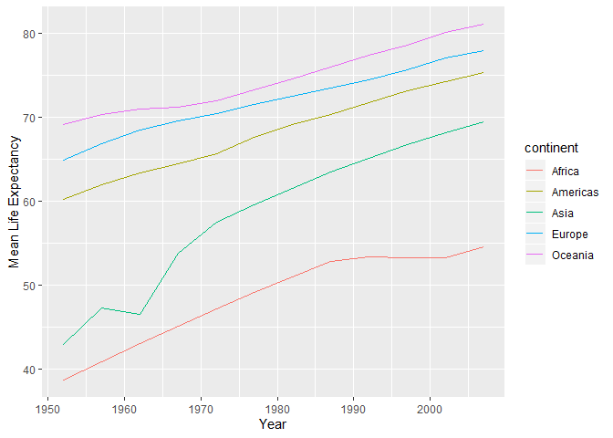<!-- -->

As observed from the table, life expectancy has increased in all continents over the years.

### Task 6
Lastly, we touch upon two interesting facts that we encountered over the past assignments and we give a more in-depth explanation of what these oddities in the dataset are due to. First of all, we noticed in the past assignments that in Rwanda, in the 1990's there has been a significant drop in life expectancy.


```r
gapminder %>% 
  filter(country == "Rwanda") %>% 
  ggplot(aes(x=year, y=lifeExp)) + 
  geom_line() +
  xlab("Year") + ylab("Life Expectancy") + labs(title="Rwanda life expectancy") + 
  theme(plot.title = element_text(hjust = 0.5))
```

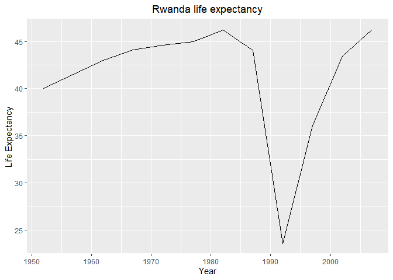<!-- -->

The drop in life expectancy in Rwanda can be easily attributed to the Rwandan civil war that lasted from 1990 to 1994 and saw the genocide of almost 1 million people.

The second interesting fact regards Kuwait. In assignment 2 I found that Kuwait had the highest GDP per capita worldwide for until the 1980's, when this dropped drastically.


```r
gapminder %>% 
  filter(country == "Kuwait") %>% 
  ggplot(aes(x=year, y=gdpPercap)) +
  geom_line()+
  xlab("Year") + ylab("GDP per capita") + scale_y_continuous(labels = scales::dollar_format()) + 
  labs(title = "GDP per capita Kuwait") + theme(plot.title = element_text(hjust=0.5))
```

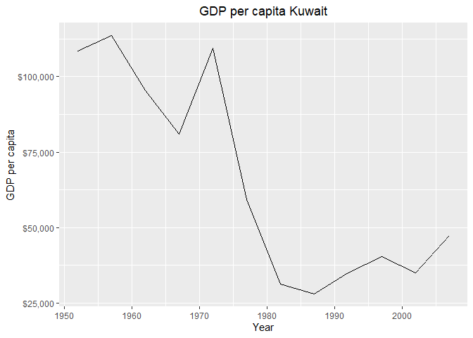<!-- -->

The sudden and sharp drop in GDP per capita can be attributed to the oil crises of 1973 and 1979 that saw oil prices rising sharply due to an embargo. Kuwait being one of the major exporters of oil has obviously been impacted.

##  Conclusion
In this assignment we analysed more in detail the gapminder dataset. We found that GDP per capita has tended to rise over the years, although some continents presented large fluctuations. Furthermore, we found that the spread in GDP per capita within continents is rather large with significant differences between maximum and minimum GDP per capita in all continents but Oceania. Oceania however, only contains 2 countries with similar economies, therefore we did not expect large differences. 

In this report we also analysed how life expectancy changed over the years. We showed precautions that could be taken to avoid biasing the estimate for the mean life expectancy and found that in all continents the mean life expectancy has increased over the years.

Lastly, we concluded with a brief analysis of interesting facts about two countries in the dataset.


