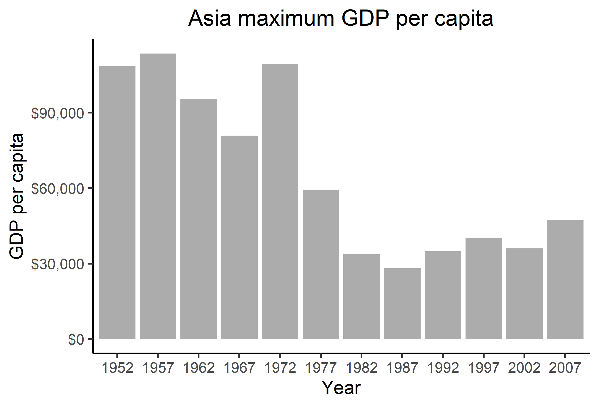

```{r setup, include=FALSE}
knitr::opts_chunk$set(echo = TRUE)
```

## Exercise 1

From the article on the [here::here](https://malco.io/2018/11/05/why-should-i-use-the-here-package-when-i-m-already-using-projects/) package, the benefits of the package become apparent.

Firstly, it avoids the need to use `rm(list=ls())` and `setwd()` which most of the times does not make the code reproducible and does not fully clear the R environment. In fact, `setwd()` requires the user to specify a path to the working directory and this path differs for every user, hence the reproducibility issue. Furthermore, `rm(list=ls())` does not remove all the veriables from the global environment as seen in class. The `here::here` package overcomes this problem by finding the working directory through a hierarchical search based on files priority. Therefore, it removes the need to manually specify a working directory, allowing for reproducibility of the code by other users.

Secondly, the package makes it very easy to navigate R projects and save files within the project. Since the path is specified according to a hierarchy, saving a file into a folder different from where the script you are running is located is simple and does not require backtracking, otherwise needed if not using the package. This is an extremely useful feature as in complicated project structures it reduces errors and increases readability of the code. This feature is also useful when opening files.

These are the main advantages of using the `here::here` package.


## Exercise 2: Gapminder data
```{r, warning=FALSE, message=FALSE}
library(tidyverse)
library(gapminder)
library(here)
library(gridExtra)
```

### Drop factor
Filter the Gapminder data to remove observations associated with the continent of Oceania. Additionally, remove unused factor levels.

Before dropping Oceania from the continents, we show how many levels are in the factor `continent` and the factor names

```{r}
gapminder %>% 
  nrow()

gapminder$continent %>% 
  nlevels()

gapminder$continent %>% 
  levels()
```

The unfiltered gapminder dataset contains 1704 rows. The continent factor has 5 levels and Oceania is among them. Now we filter all rows for Oceania and drop the level.

```{r}
gap_filtered = gapminder %>% 
  filter(continent != "Oceania")

gap_filtered %>% 
  nrow()

gap_filtered$continent %>% 
  droplevels() %>% 
  nlevels()

gap_filtered$continent %>% 
  droplevels() %>% 
  levels()
```

We have filtered all rows corresponding to Oeania from gapminder and are left with 1680 rows. We dropped the level Oceania from the dataset and now we have 4 levels for continent and Oceania is not among them.

### Reorder the levels of `country`

Next we reorder the levels in the country factor based on the minimum GDP per capita over the years. In particular, we show this with a plot.

Without reordering, plotting GDP per capita vs. country would look like this.

```{r, fig.height=15}
gapminder %>% 
  group_by(country) %>% 
  summarise(min_gdp = min(gdpPercap)) %>% 
  ggplot(aes(x=min_gdp, y=country)) +
  geom_point() + 
  scale_x_log10()+
  labs(x="Minimum GDP per capita", y="Country", title = "Minimum GDP per capita by country over the years") + 
  theme(plot.title = element_text(hjust = 0.5))
```

From this plot, it would be difficult to understand which countries reached the lowest levels of GDP per capita over the years. However, reordering the factor we can immediately see what we are looking for.

```{r, fig.height=15}
gapminder %>% 
  group_by(country) %>% 
  summarise(min_gdp = min(gdpPercap)) %>% 
  ggplot(aes(x=min_gdp, y=country)) +
  geom_point(aes(y=fct_reorder(country, min_gdp, "identity"))) + 
  scale_x_log10()+
  labs(x="Minimum GDP per capita", y="Country", title = "Minimum GDP per capita by country over the years") + 
  theme(plot.title = element_text(hjust = 0.5))
```

## Exercise 3: File I/O

Here we will use the gapminder dataset to save and load a new file. We will use `write_csv()/read_csv` for this task.

### Saving a file

We compute some summary statistics of the gapminder data on a continent level and save the obtained dataset to disk.

```{r}
(gapminder_summarised = gapminder %>% 
  group_by(continent) %>% 
  summarise(mean_gdp = mean(gdpPercap), max_gdp = max(gdpPercap), min_gdp = min(gdpPercap), sd_gdp = sd(gdpPercap)))

gapminder_summarised %>% 
  write_csv(here::here("gapminder_summarised.csv"))
```

Now we reload the dataset.

```{r, message=FALSE, warning=FALSE}
(gapminder_summarised = read_csv(here::here("gapminder_summarised.csv")))
```

From this we see that the factor continent is transformed to a character. To overcome this issue we need to specify `col_types` in the `read_csv` function. 

```{r}
(gapminder_summarised = read_csv(here::here("gapminder_summarised.csv"),  col_types = cols(continent=col_factor())))
```

Now the continent column is a factor ordered alphabetically.

```{r}
gapminder_summarised$continent %>% 
  levels()
```

Plotting the standard deviation in GDP per capita we obtain.

```{r}
gapminder_summarised %>% 
  ggplot(aes(x=continent, y=sd_gdp))+ 
  geom_bar(stat = "identity") + 
  coord_flip() +
  labs(x="Standard deviation GDP per capita", y="Continent")
```

Now we reorder the factor based on the minimum standard deviation in GDP per capita.

```{r}
gapminder_summarised %>% 
  ggplot(aes(x=continent, y=sd_gdp))+ 
  geom_bar(aes(fct_reorder(continent, sd_gdp, min)),stat = "identity") + 
  coord_flip() +
  labs(x="Standard deviation GDP per capita", y="Continent")
```

## Exercise 4:Visualization design

Go back through your previous assignments and class participation activities and find figures you created prior to the last week of the course. Recreate at least one figure in light of something you learned in the recent class meetings about visualization design and color.

For this part of the assignment we look at a plot from hw03. This plot was used in hw03 to show the difference between maximum and minimum GDP per capita over the years in Asia. The plot is shown below.
```{r}
gdp_continent_year = gapminder %>% 
  group_by(continent, year) %>% 
  arrange(desc(gdpPercap)) %>% 
  filter(row_number() %in% c(1, n())) %>% 
  mutate(label_colour = ifelse(gdpPercap == max(gdpPercap), 1, 2)) %>% 
  select(continent, year, country, gdpPercap, label_colour) %>% 
  arrange(continent, year, gdpPercap)

gdp_continent_year %>% 
  filter(continent == "Asia") %>%
  ggplot(aes(x=year, y=gdpPercap, fill=factor(label_colour))) +
  geom_bar(stat = "identity", position = "dodge") +
  scale_fill_discrete(name="", breaks=c(1,2), labels=c("Maximum", "Minimum"), guide=guide_legend())  +
  scale_y_continuous(labels=scales::dollar_format()) +
  xlab("Year") + ylab("GDP per capita") + labs(title = "Asia") + theme(plot.title = element_text(hjust = 0.5))
```

This plot is very good at showing differences in maximum GDP per capita in Asia over the years, however, given the large difference between maximum and minimum GDP, we are not able to see whether fluctuations in GDP per capita also happen for the minimum GDP. We can see that the minimum GDP seems to increase over the years but from this visualisation we cannot quantify this magnitude. Hence, on top of cleaning the plot above, we will also split into one plot for maximum and one plot for minimum GDP. We won't be able to plot the the old and new plot next to each other as the new plot will involve two plots. Therefore, to substitute for this, the 2 new plots will be shown next to each other.

```{r, fig.width=10}
maximum <- gdp_continent_year %>% 
  filter(continent == "Asia") %>%
  group_by(year) %>% 
  filter(gdpPercap == max(gdpPercap)) %>% 
  ggplot(aes(x=factor(year), y=gdpPercap)) +
  geom_bar(stat = "identity", alpha=0.5) +
  scale_y_continuous(labels=scales::dollar_format()) +
  xlab("Year") + ylab("GDP per capita") + labs(title = "Asia maximum GDP per capita") +
  theme_classic() + theme(plot.title = element_text(hjust = 0.5)) 
  

minimum <- gdp_continent_year %>% 
  filter(continent == "Asia") %>%
  group_by(year) %>% 
  filter(gdpPercap == min(gdpPercap)) %>% 
  ggplot(aes(x=factor(year), y=gdpPercap)) +
  geom_bar(stat = "identity", alpha=0.5) +
  scale_y_continuous(labels=scales::dollar_format()) +
  xlab("Year") + ylab("GDP per capita") + labs(title = "Asia minimum GDP per capita") +
  theme_classic() + theme(plot.title = element_text(hjust = 0.5)) 

grid.arrange(maximum, minimum, ncol=2)
```

By splitting the plot into two plots, one for maximum and one for minimum GDP we can draw better conclusions from the data and infer something we could not have inferred before. While the conclusions for the maximum GDP are the same, thanks to this different visualisation, we can now observe how minimum GDP varies over the years. In particular, we can observe that the minimum GDP per capita has tripled between the years 1992 and 2007. In the old version of the plot we were not able to deduce the magnitude of the increase in GDP per capita. Furthermore, when plotted on a scale ranging from 0 to 90,000 this significant increase did not appear to be worthwhile commenting. The new plot also has ticks for each year on the x-axis, making it easier to interpret for a person that doesn't know the dataset that generated the data. Removing the grid in the background and lightening the bars colour are other factors that contribute to enhancing readability of the graphs. Overall, the new graphs contain all information a person needs to draw meaningful conclusions.

## Exercise 5: Writing figures to file

In this exercise we save a plot using `ggsave()` and reload the plot into the report. The function `ggsave()` saves the last plot that has been plotted in the environment therefore, depnding on the order of execution of the different commands, the plot that will be saved might not be the one we actually want to save. Hence why we usually use the `plot=...` argument in `ggsave()` if we want to make sure of what plot we are saving. In our case we will be saving the plot for the maximum GDP per capita in Asia from exercise 4.

```{r}
ggsave(filename = here::here("maximum_gdpPerCap.png"), plot=maximum, height=8.5, width=12.5, units="cm", dpi=550)
```

The arguments `height` and `width` specify the dimensions of the plot we are saving. In this case we specified `units="cm"` to make sure those dimensions were in centimeters and not in inches as R uses by default. In addition to this we specified the resolution of the plot with `dpi`.

Now we reload the plot into the report.

